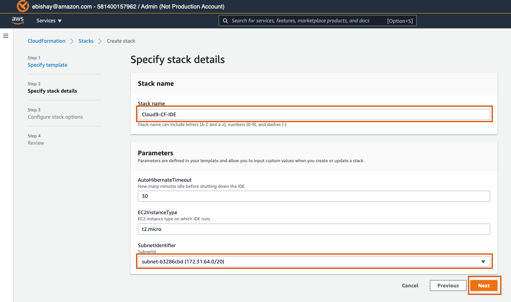
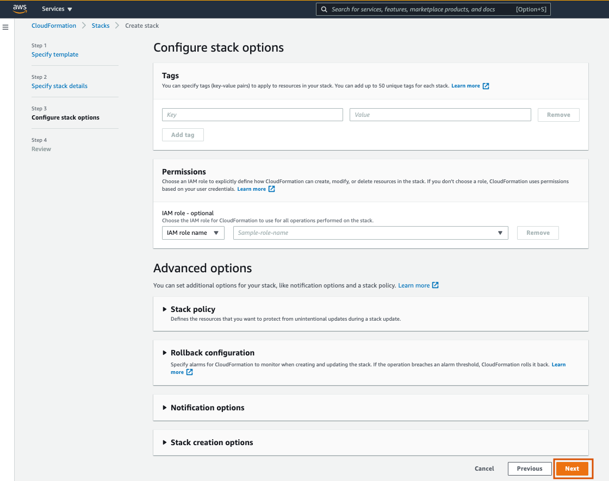
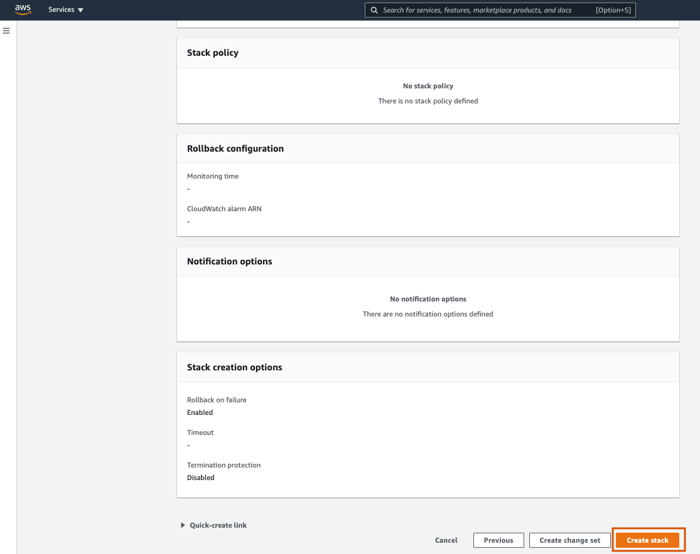
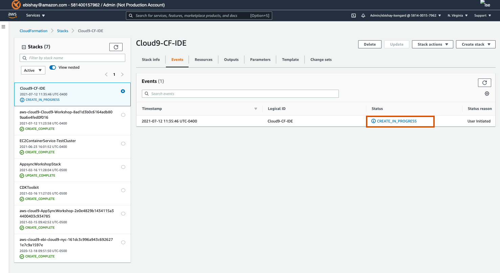
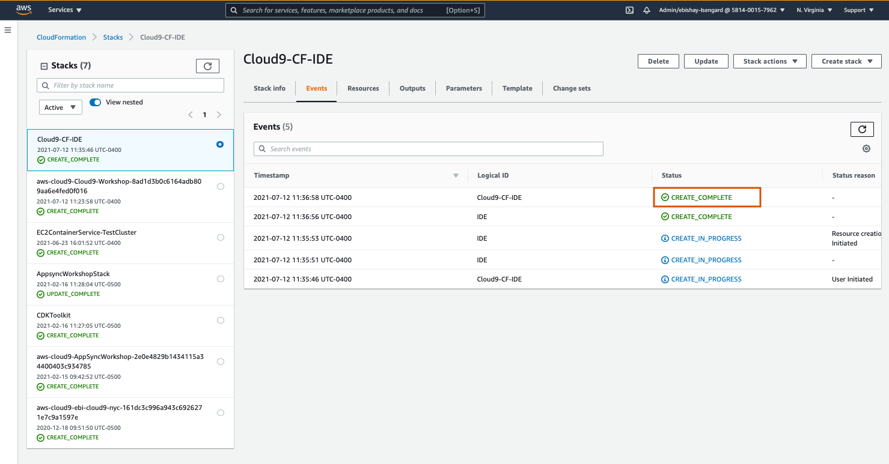
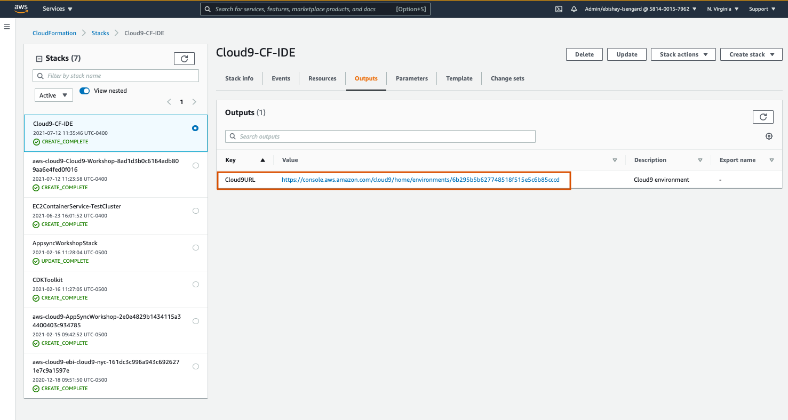
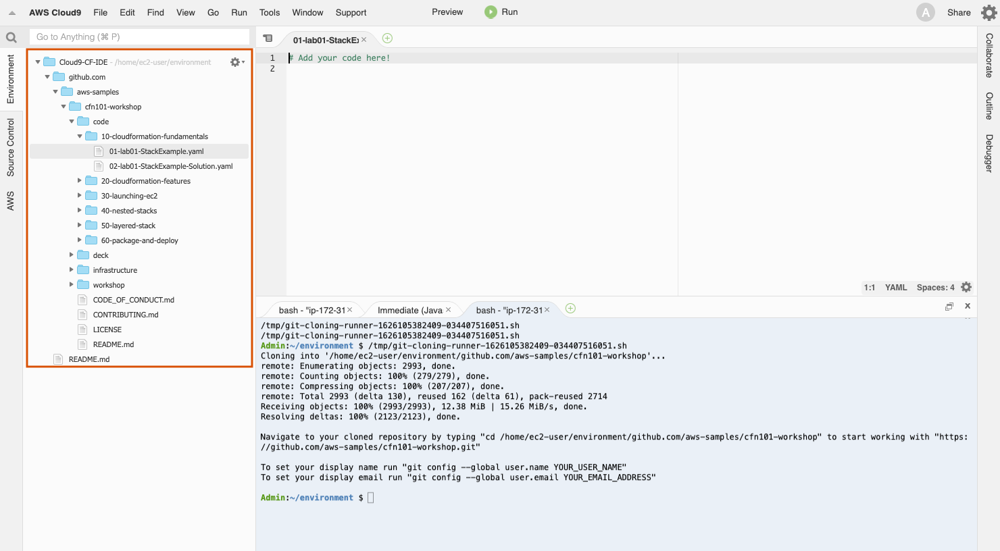

# CLOUD9 IDE

AWS Cloud9 is a cloud-based integrated development environment (IDE) that lets you write, run, and debug your code with just a browser. It includes a code editor, debugger, and terminal. Cloud9 comes prepackaged with essential tools for popular programming languages, including JavaScript, Python, PHP, and more, so you don’t need to install files or configure your development machine to start new projects. Since your Cloud9 IDE is cloud-based, you can work on your projects from your office, home, or anywhere using an internet-connected machine. 
[Learn more about Cloud9](https://aws.amazon.com/cloud9/)

The workshop requires that a default VPC is available in the region you will be deploying CloudFormation templates to (You will have a default VPC unless you have removed it)

You may use any code editor or IDE of your choice that supports editing YAML but for this workshop we will assume the use of AWS Cloud9 IDE on AWS Cloud.

We are going to use CloudFormation to create a new instance of Cloud9 within you AWS temporary account crated for you by your account team.

### 1. Create a Cloud9 IDE

1. Open the Amazon CloudFormation console at [https://console.aws.amazon.com/](https://console.aws.amazon.com/) 
   
   

2. Use the Amazon console search bar and search for **CloudFormation**

    

3. In the search bar pane, choose **CloudFormation**.

4. On the top right corner press the **Create stack** button

    

5. In the **Create stak** screen select the following options:

    

   1. Choose **Template is ready** option
   2. Choose **Upload a template file** option
   3. Download the Cloud9 IDE CloudFormation template using this [link](https://raw.githubusercontent.com/eliranbi/AWSCloudFormation/main/code/Cloud9_CloudFormation_Template.yaml) and save the file on your local environment, name it **Cloud9_CloudFormation_Template.yaml**
   4. Press on the  **Chose file** button and select the **Cloud9_CloudFormation_Template.yaml** file and press the **Open** button

    

   5. Press on the **Next** button
6. Choose **Create**. Close the confirmation screen.
7. On the **Specify stak details** page enter the Stack name **Cloud9-CF-IDE**
8. Press the **Subnetidentifier** input field and select the first subnet
    
    

9.  Press the **Next** button
    

10. On the **Configure stack options** page scroll to the borrom and press the **Next** button

    

11. On the next page scroll to the borrom and press the **Create stack** button

    

12. Monitor the progress of the stack creation you can use the refresh button on the top right corner to view the latest state

    

13. Once the stack creation completed you should see **CREATE_COMPLETE** status

    

14. Click on the **Output** tab and press on the **Cloud9URL** 

    

15. Click on the **Open IDE** button to start the Cloud9 IDE

    

16. Once you press on the Open IDE button you should see the Cloud9 IDE start up

    

17. Once the Cloud9 IDE finished you can see the AWS Cloud9 Welcome message 

    

18. You can close the file and select on the environment on the top left conrer and navigate to the first file of the lab **01-lab01-StackExample.yaml**
    
    

Congratulations, you have successfully bootstrapped an AWS Cloud9 using CloudFormation template! In the next section you will learn the CloudFormation fundamentals 

