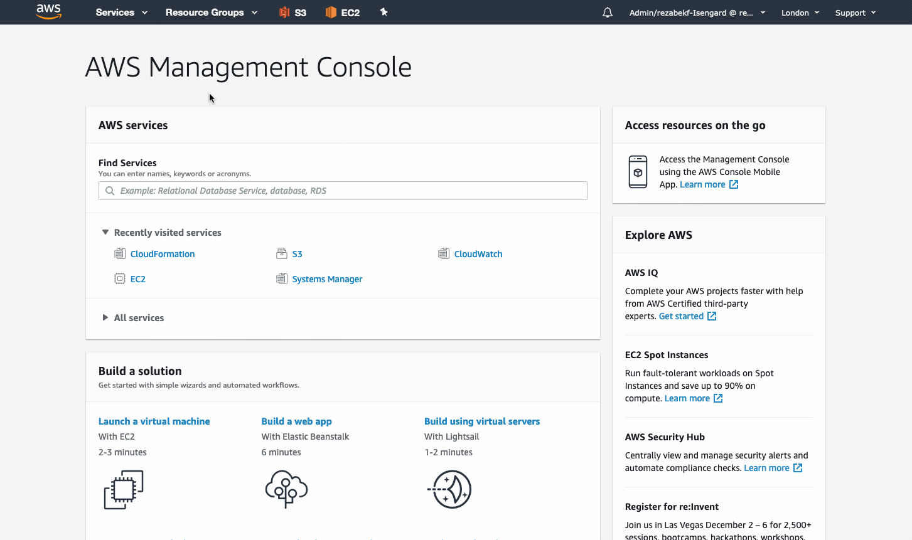

### Overview

In this lab you will learn about **[Outputs](https://docs.aws.amazon.com/AWSCloudFormation/latest/UserGuide/outputs-section-structure.html)**. _Outputs_ enable you to get access to information about resources within a stack. For example, you can output an EC2
instance's Public DNS name once it is created.

Furthermore, output values can be imported into other stacks. These are known as cross-stack references.

##### YAML Syntax:
The _Outputs_ section consists of the key name `Outputs`, followed by a colon.

```yaml
Outputs:
  Logical ID:
    Description: Information about the value
    Value: Value to return
    Export:
      Name: Value to export
```

{}
You can declare a maximum of 60 outputs in a template.
{}

### Topics Covered
In this Lab, you will:

+ Create an Output section in your template and return Public DNS name of the instance.
+ Create Elastic IP resource and attach it to the EC2 instance.
+ Learn how to view outputs form within CloudFormation in AWS console.

### Start Lab

1. Go to the `code/20-cloudformation-features/` directory.
1. Open the `07-lab05-Outputs.yaml` file.
1. Copy the code as you go through the topics below.

    To get the _PublicDnsName_ of the instance, you will need to use `Fn::GetAtt` intrinsic function. Let's first check the [AWS Documentation](https://docs.aws.amazon.com/en_pv/AWSCloudFormation/latest/UserGuide/aws-properties-ec2-instance.html#aws-properties-ec2-instance-return-values) for available attributes. You can see that _PublicDnsName_ is valid return value for `Fn::GetAtt` function.

    Add the section below to your template:
    
    ```yaml
    Outputs:
      EC2PublicDNS:
        Description: 'Public DNS of EC2 instance'
        Value: !GetAtt WebServerInstance.PublicDnsName
   ```

1. Go to the AWS console and update your stack with a new template.
{}

{}

1. View the output value on the [AWS CloudFormation console](https://console.aws.amazon.com/cloudformation), in the _Outputs_ tab.
{}

{}

### Challenge

In this exercise, you should assign an Elastic IP to your EC2 instance. Then, add an output of the Elastic IP to the _Outputs_ section of the template. You should continue using the `07-lab05-Outputs.yaml` template.

1. Create an `AWS::EC2::EIP` resource and attach it to your existing EC2 instance.
1. Create a logical ID called `ElasticIP` and add it to the Outputs section of the template.
1. Update the stack to test changes in your template.

{}
Check out the AWS Documentation for [AWS::EC2::EIP resource](https://docs.aws.amazon.com/en_pv/AWSCloudFormation/latest/UserGuide/aws-properties-ec2-eip.html)
{}

{}

```yaml
Resources:
  WebServerInstance:
    Type: AWS::EC2::Instance
    Properties:
      ImageId: !Ref AmiID
      InstanceType: !FindInMap [EnvironmentToInstanceType, !Ref EnvironmentType, InstanceType]
      Tags:
        - Key: Name
          Value: !Join [ '-', [ !Ref EnvironmentType, webserver ] ]

  WebServerEIP:
    Type: 'AWS::EC2::EIP'
    Properties:
      Domain: vpc
      InstanceId: !Ref WebServerInstance

Outputs:
  WebServerPublicDNS:
    Description: 'Public DNS of EC2 instance'
    Value: !GetAtt WebServerInstance.PublicDnsName

  WebServerElasticIP:
    Description: 'Elastic IP assigned to EC2'
    Value: !Ref WebServerEIP
```
{}

---
### Conclusion

Great work! You have now successfully learned how to use **Outputs** in CloudFormation template.
